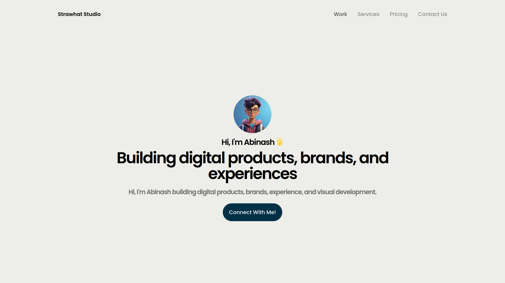

# Tailwind Practice Project

This project is for learning and practicing Tailwind CSS by creating a simple landing page.

## Overview

The goal is to recreate a nice looking landing page design using Tailwind utility classes. It will not use any custom CSS.

The page will demonstrate common Tailwind components like:

- Navigation menu
- Hero sections
- Buttons
- Responsive design

It allows getting familiar with Tailwind class names and how to construct UIs without writing CSS.

## Screenshot



## Usage

### Installation

```
npm install
```

### Run dev server

```
npm run dev
```

This serves the project locally for development using Vite.

### Deploy

You can deploy the `dist` folder to any static site host.

## Outcome

After completing this project, you will have basic familiarity with:

✅ Setting up Tailwind
✅ Common utilities for layout, styling, components
✅ Responsive mobile-first design
✅ Customizing colors and configuration

You can use this as a starting point for integrating Tailwind into React, Vue, or any other project.

Let me know if you have any other questions!
